# Portfolio

This repository gathers some of my study projects and other qualifications for easy viewing and access.

## [Web state and storage tech - Nov 2024](https://github.com/Romaalie/web-state-and-storage-tech "External link to project repository on GitHub")

A small solo project with the aim to explain and visualize some basic web tech such as Cookies, JWT, Session ID and Local Storage.
The project has a minimal web UI with Local Storage being the only part visualizing it's functionality. 

Keywords:
- TypeScript
- Next.js
- Tailwind CSS
- Project management

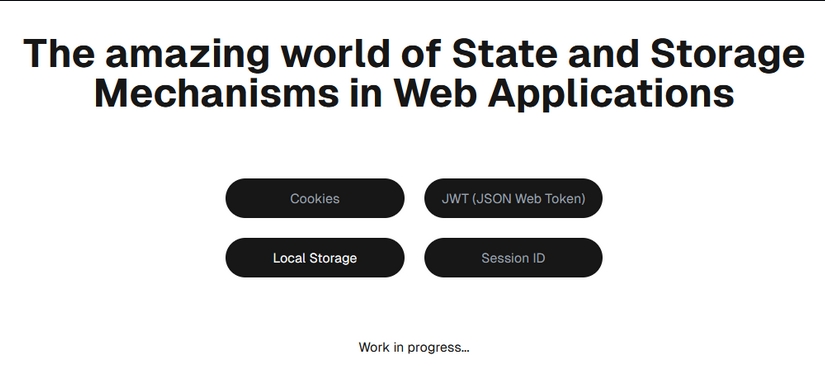

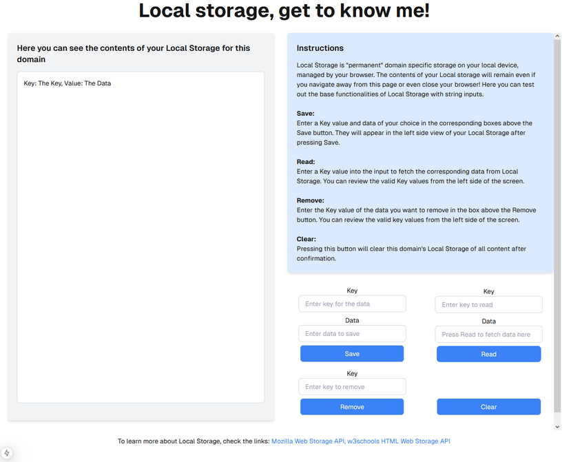

Even though this was a solo project, project management was part of the assignment and it was handled with GitHub projects.  

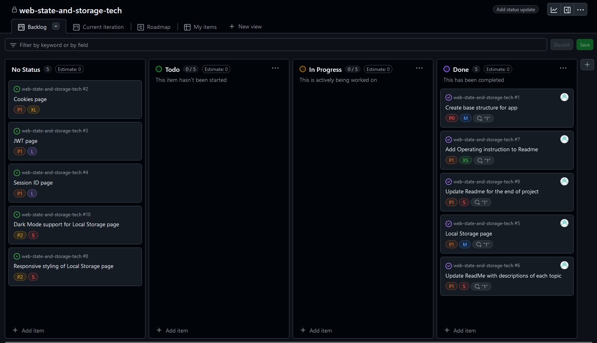

## [Our Story - Mobile app, mobile programming course final project - Nov 2024](https://github.com/Romaalie/OurStory "External link to project repository on GitHub")

A solo project with the aim to create a functional concept level mobile app with TypeScript, React Native and Expo.
The app has a simple UI with more of the work focusing on the handling of user data with firebase and dropbox in addition to studying the OAuth 2.0 PKCE flow more closely.

"Concept:  
An application for creating simple stories and the ability to view created stories at a later date.
A story consists of one or more templated pages which have one image as a background and a textbox at the bottom.
The initial usage of this app was inteded for a parent and a child to create their own stories together."

Keywords:
- TypeScript
- Expo
- React Native
- Firebase
- Dropbox
- OAuth 2.0
- Android Emulator

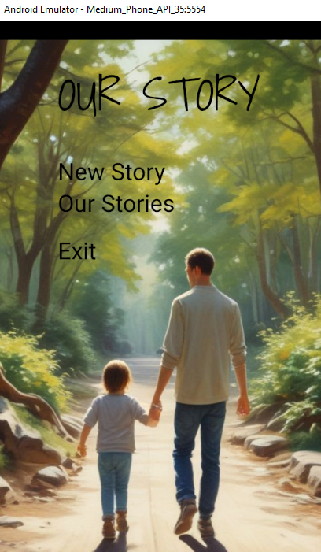

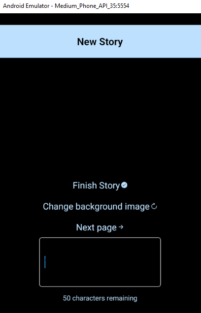

## [Ticket Sales system - Spring 2024](https://github.com/Romaalie/Lipunmyyntijarjestelma "External link to project repository on GitHub")

A group project with the aim to create a simple ticket sales system with main focus on backend.
The project started with defining the service and it's requirements.
User groups, stories and use cases were defined by our 4 person student project team.
We designed SQL database tables and implemented the database later in the project with a live deployment version of the backend and database published at Rahti service of CSC.
We created a REST API for the backend and an mvp type frontend UI as was requested in the project assignment.
All or most of the project files and documentation is in finnish.

Keywords:
- Java
- Spring boot
- Project management
- Teamwork
- Rest API
- MySql database
- Documentation
- Finnish

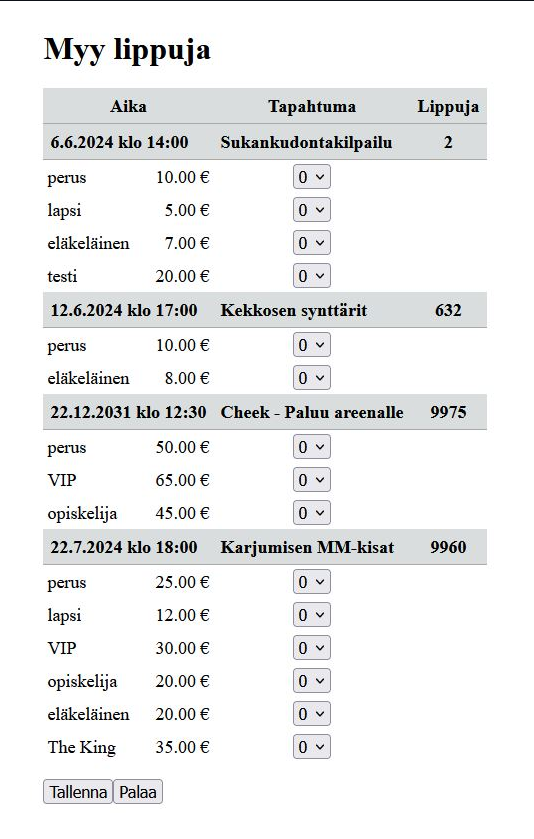

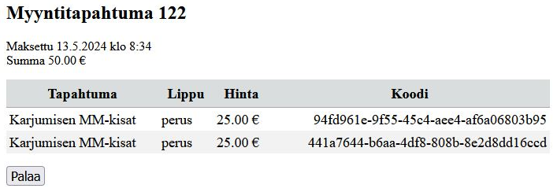

## [Budget web app - backend course final project - Spring 2024](https://github.com/Romaalie/backend-harjoitustyo "External link to project repository on GitHub")

A solo project aiming to create a web app to enable bugdet management for a small household.
In addition to a simple web UI implemented with Spring MVC and Thymeleaf, the project includes a separate REST API.
Some automated tests were created for the REST API, as well as integration tests to ensure basic CRUD operations for JPA entities.
The project is deployed on [render.com](https://backend-harjoitustyo-htim.onrender.com/ "External link to render") where it can be tested.
Username/password for all three users should be easily guessable but can be requested via email.
All or most of the project documentation/comments are in finnish.

Keywords:
- Java
- HTML
- Spring boot
- Junit
- Automated testing
- REST API
- Thymeleaf
- PostgreSQL database
- Finnish

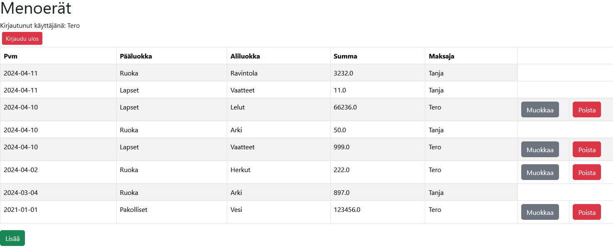

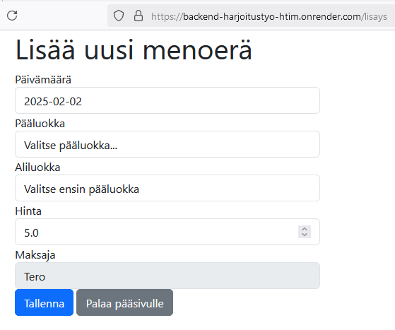

## Transcript of Records - Feb 5 2025

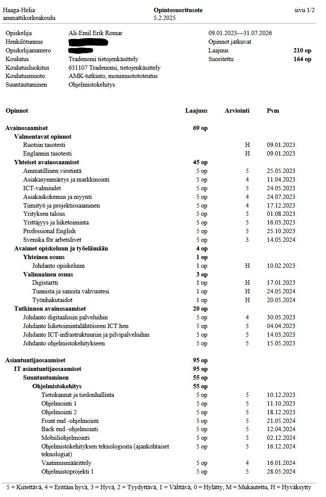
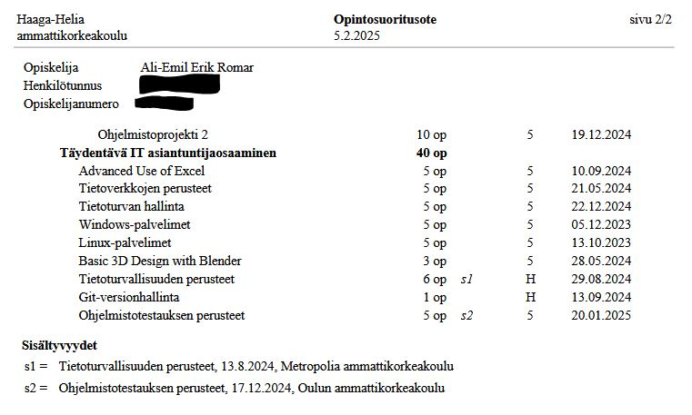
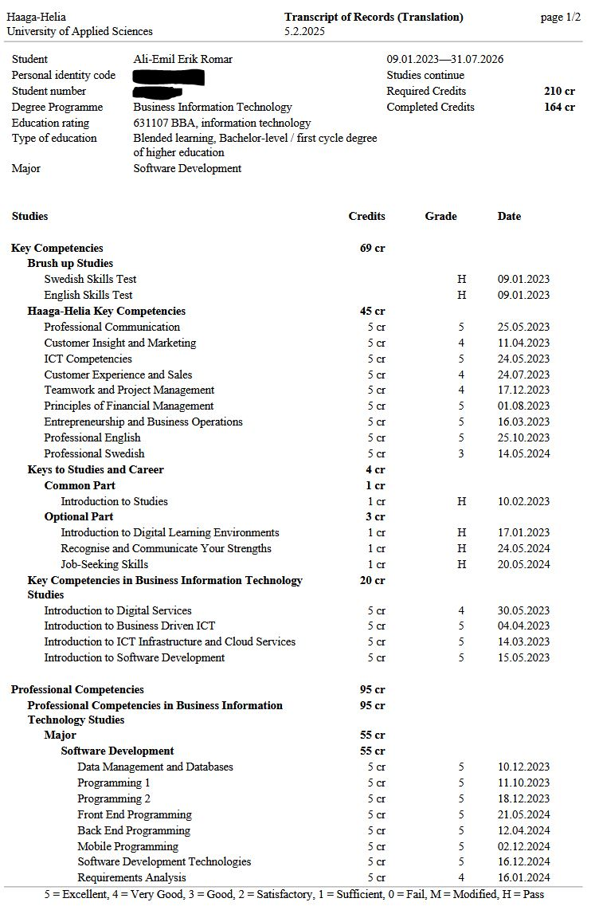
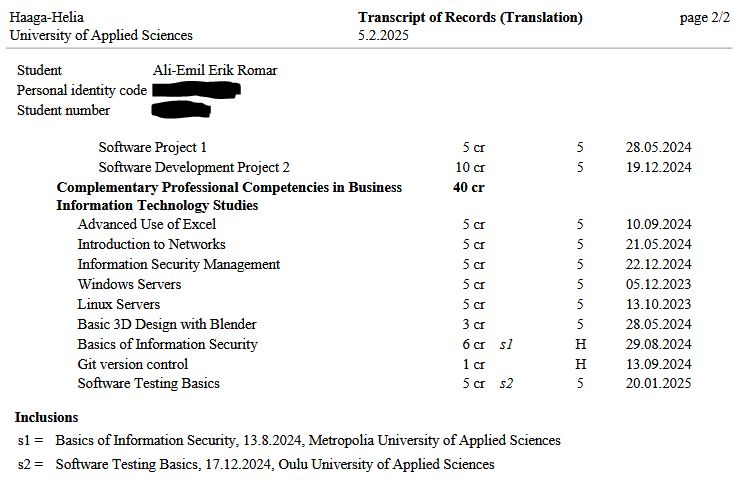

## Certifications

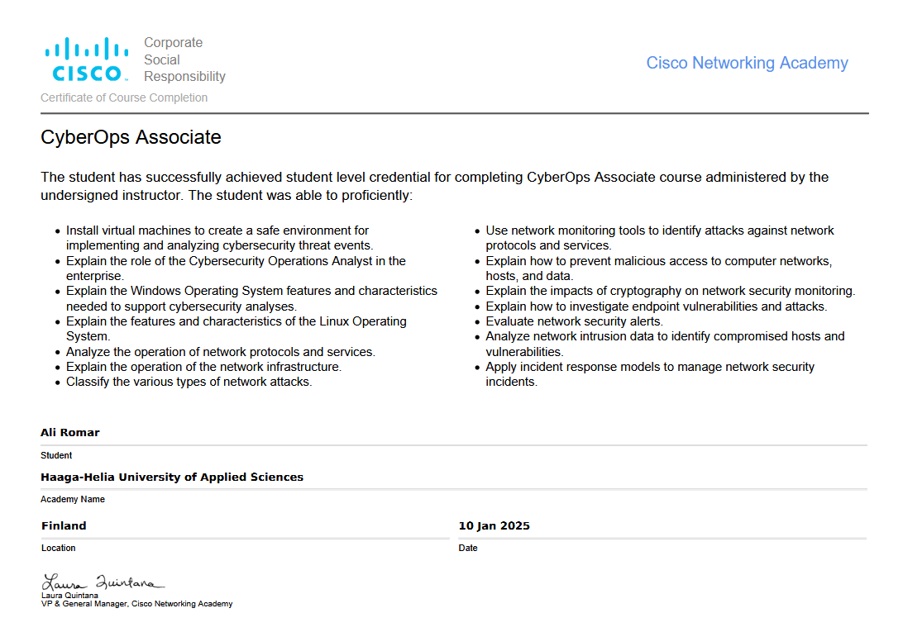